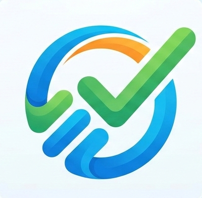

# Task Tracker

A daily interview preparation planner that helps you stay consistent across DSA, Development, Core Subjects, and more.



## Features

- **Daily Task Tracking** — Categories with subtasks, notes, and checkmarks
- **Streaks & Progress** — Visual progress ring and streak counters
- **Week View** — See your weekly completion at a glance
- **Add/Edit/Delete** — Fully customizable categories and subtasks
- **Cloud Sync** — Sync across devices using a 6-character code (Firebase)
- **PWA** — Installable on Mac, iPhone, and Android as a native-like app
- **Offline Support** — Works without internet, syncs when back online
- **Daily Challenges & Fun Facts** — Something fun after your tasks

## Tech Stack

- React 18
- Vite
- Firebase Firestore (real-time sync)
- PWA (vite-plugin-pwa)

## Getting Started

```bash
# Install dependencies
npm install

# Run dev server
npm run dev

# Build for production
npm run build
```

## Firebase Setup

1. Create a project at [console.firebase.google.com](https://console.firebase.google.com)
2. Add a web app and copy the config
3. Enable Firestore Database in test mode
4. Create a `.env` file:

```env
VITE_FIREBASE_API_KEY=your_api_key
VITE_FIREBASE_AUTH_DOMAIN=your_project.firebaseapp.com
VITE_FIREBASE_PROJECT_ID=your_project_id
VITE_FIREBASE_STORAGE_BUCKET=your_project.firebasestorage.app
VITE_FIREBASE_MESSAGING_SENDER_ID=your_sender_id
VITE_FIREBASE_APP_ID=your_app_id
```

## Deploy

Deploy to Vercel, Netlify, or any static host. Add the env variables in your hosting provider's settings.

## Sync Across Devices

1. Open the app on your first device
2. Click **Sync** in the footer
3. Generate a code
4. Enter the same code on your other devices

No account needed — just a 6-character code.
